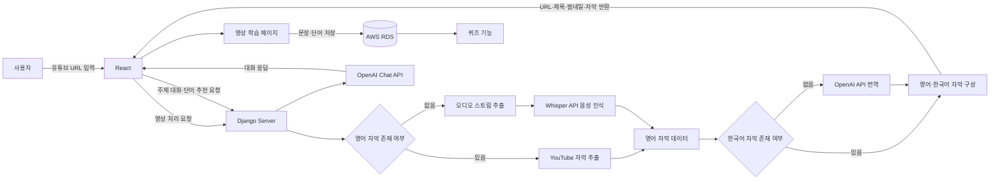

# 🎬 AI 빅데이터 기술을 활용하는 영어학습 솔루션

> 사용자가 입력한 유튜브 영상을 영어 학습 콘텐츠로 변환하는 웹 서비스입니다.  
> 영상의 자막 유무에 따라 YouTube 자막, Whisper 음성 인식, OpenAI 번역을 선택적으로 적용해 영어·한국어 스크립트를 제공하고, 영상 학습·챗봇·퀴즈·학습 기록 기능을 구현했습니다.

🔗 **GitHub Repository**  
https://github.com/hera1228/book_store

---

## 📝 프로젝트 개요

- **프로젝트명**: AI 빅데이터 기술을 활용하는 영어학습 솔루션
- **팀명**: 영솔
- **프로젝트 유형**: 한이음 ICT 멘토링
- **설계서 작성일**: 2024.07.16
- **담당 역할**: 백엔드 개발
- **주요 담당 업무**
  - 유튜브 영상 URL 처리 기능 구현
  - 영상 자막 및 오디오 추출
  - Whisper API 기반 영어 음성 인식
  - OpenAI API 기반 한국어 자막 번역
  - 영어·한국어 스크립트 응답 구조 구현
  - 대화 기록을 반영하는 챗봇 로직 구현
  - 영상·문장·단어·퀴즈 데이터 구조 설계
  - 프론트엔드 연동을 위한 API 개발 및 테스트
- **프로젝트 목적**
  - 유튜브 영어 영상을 학습 자료로 활용할 수 있도록 자막·번역·문장 분석 기능을 제공
  - 영상에서 학습한 문장과 단어를 저장하고 퀴즈로 복습할 수 있는 학습 흐름 구현
  - 영상 주제 대화, 추천 단어, 추천 회화 기능을 제공하는 AI 챗봇 구현

---

## 🛠 기술 스택

### Backend

- Python
- Django
- OpenAI API
- YouTube API
- pytube
- Whisper API

### Frontend

- JavaScript
- React
- MUI

### Infrastructure

- AWS EC2
- AWS RDS
- Ubuntu
- Windows

### Development Tools

- Visual Studio
- PyCharm
- Git
- GitHub
- Postman

### Collaboration

- Figma
- Notion
- Google Docs
- Google Meet
- KakaoTalk

---

## 📊 시스템 아키텍처



---

## 🔄 서비스 처리 흐름

### 1. 영상 URL 전송

1. 사용자가 학습하려는 유튜브 영상의 URL을 입력합니다.
2. React에서 URL을 Django 서버로 전달합니다.
3. 서버는 입력값이 유튜브 URL인지 확인합니다.
4. 이미 등록된 영상인지 확인합니다.
5. 정상적인 영상이면 자막 처리 과정을 시작합니다.

### 2. 영어 자막 처리

영어 자막의 존재 여부에 따라 처리 방식을 분기합니다.

- 영어 자막이 존재하면 YouTube에서 자막을 가져옵니다.
- 영어 자막이 없으면 영상의 오디오 스트림을 추출합니다.
- 추출한 오디오를 Whisper API에 전달해 영어 텍스트로 변환합니다.
- 각 문장은 `text`, `start`, `duration` 정보를 포함하도록 구성합니다.

### 3. 한국어 자막 처리

- 기존 한국어 자막이 있으면 해당 자막을 활용합니다.
- 한국어 자막이 없으면 영어 자막 데이터를 OpenAI API에 전달합니다.
- 번역된 한국어 자막을 영어 자막의 시간 정보와 함께 구성합니다.

### 4. 학습 화면 구성

서버는 다음 데이터를 프론트엔드에 전달합니다.

- 영상 URL
- 영상 제목
- 썸네일
- 전체 영어 스크립트
- 영어 자막 목록
- 한국어 자막 목록
- 자막별 시작 시간과 재생 시간

React에서는 전달받은 데이터를 이용해 영상, 영어 자막, 한국어 자막, 문장 설명을 화면에 표시합니다.

### 5. 학습 기능

사용자는 영상 학습 페이지에서 다음 기능을 사용할 수 있습니다.

- 영상 재생 및 일시 정지
- 재생 속도 조절
- 10초 앞으로 이동
- 10초 뒤로 이동
- 영어 자막 켜기·끄기
- 한국어 자막 켜기·끄기
- 특정 문장 선택
- 문장 내부 단어·관용어·문법 분석
- 문장 및 단어 저장
- 스피킹 연습
- 발음 기호 확인
- 발음 녹음 및 평가

---

## 🔍 주요 기능

### 1. 회원 관리

- 일반 로그인
- 카카오 소셜 로그인
- 회원가입
- 이메일 인증
- 아이디 찾기
- 비밀번호 찾기
- 이용약관 동의
- 개인정보처리방침 동의
- 로그아웃
- 회원 탈퇴

### 예외 처리

- 잘못된 아이디 또는 비밀번호 입력 시 오류 메시지 제공
- 이미 사용 중인 아이디 입력 시 중복 안내
- 비밀번호 확인값이 일치하지 않을 경우 오류 메시지 제공
- 회원 탈퇴 시 사용자 상태를 탈퇴 회원으로 변경

---

### 2. 유튜브 영상 등록

- 사용자가 입력한 유튜브 URL을 서버에 전달
- URL 형식 검증
- 기존 학습 영상 중복 여부 확인
- 영상 제목과 썸네일 정보 수집
- 학습 영상 목록에 저장

### 예외 처리

- 유튜브 URL이 아닌 경우 안내 메시지 제공
- 이미 등록된 영상인 경우 중복 안내 메시지 제공
- 자막을 가져오지 못하는 경우 Whisper 기반 처리로 전환

---

### 3. 영어·한국어 자막 제공

- 영상에 저장된 영어 자막 추출
- 영어 자막이 없는 경우 오디오 스트림 다운로드
- Whisper API를 통한 음성 텍스트 변환
- 한국어 자막이 없는 경우 OpenAI API를 통한 번역
- 영어·한국어 자막을 시간 정보와 함께 반환

---

### 4. 영상 학습

- 영상 재생 및 일시 정지
- 영상 재생 속도 조절
- 구간 이동
- 자막 선택적 표시
- 자막 클릭 시 해당 문장 학습
- 특정 문장의 단어, 문법, 관용 표현 분석
- 문장 및 단어 저장

---

### 5. 스피킹 및 발음 학습

- 특정 문장 선택 후 스피킹 모드 진입
- 사용자 음성 녹음
- 발음 평가 API를 통한 발음 점수 제공
- 문장별 발음 기호 표시
- 녹음 결과를 기반으로 발음 교정 정보 제공
- 문법 또는 어휘 오류가 있다고 판단되는 문장 수정

---

### 6. 학습 기록

- 사용자가 학습한 영상 목록 조회
- 영상별 저장 문장 조회
- 영상별 저장 단어 조회
- 중요 단어와 문장을 자동 저장 목록으로 구성
- 저장된 문장을 선택해 문장 분석 페이지로 이동
- 저장된 데이터를 퀴즈에 활용

---

### 7. AI 챗봇

챗봇은 사용자의 요청 유형에 따라 다음 기능을 제공합니다.

#### 영상 주제 대화

- 사용자가 선택한 영상의 내용을 기반으로 대화
- 영상 학습 내용과 관련된 질문 및 답변 제공
- 기존 대화 내역을 함께 전달해 연속적인 대화 유지

#### 추천 단어

- 학습에 활용할 영어 단어 10개 제공
- 단어와 한국어 의미를 함께 제공
- 영상과 관계없는 일반 단어 추천도 가능

#### 추천 회화

- 외국인이 자주 사용하는 회화 표현 5개 제공
- 실생활에서 활용할 수 있는 표현과 의미 제공

#### 일반 채팅

- 별도의 학습 유형을 선택하지 않은 경우 일반 ChatGPT 대화 제공

---

### 8. 퀴즈

#### 랜덤 퀴즈

- 사용자가 시청한 전체 영상의 문장과 단어를 활용
- 단어 퀴즈 또는 문장 퀴즈 제공

#### 저장 문장 퀴즈

- 사용자가 직접 저장한 문장을 기반으로 퀴즈 생성
- 영상별 저장 문장 선택 가능
- 최대 10문제 제공

#### 오답 퀴즈

- 기존 퀴즈에서 틀린 문제만 다시 제공
- 단어 오답과 문장 오답을 구분해 관리

### 예외 처리

- 저장된 문장이나 단어가 없는 경우 안내 메시지 제공
- 퀴즈 기록이 없는 경우 랜덤 퀴즈 제공
- 오답 기록이 없는 경우 오답 문제가 없다는 메시지 제공

---

## 🗂 메뉴 구성

```text
스플래시 화면
├── 로그인
├── 회원가입
└── 사용자 가이드

홈페이지
├── 영상 학습 페이지
│   ├── 스피킹 모드
│   └── 문장 공부 모드
├── 퀴즈 페이지
│   ├── 단어 퀴즈
│   └── 문장 퀴즈
├── 챗봇 페이지
│   └── 주제 챗봇 모드
└── 학습 내역 저장 기록
    ├── 영상 목록
    ├── 문장 목록
    └── 단어 목록
```

---

## 📊 데이터베이스 설계

### ERD

<!-- 실제 ERD 이미지 경로에 맞게 수정 -->


### 주요 테이블

| 테이블 | 주요 필드 | 역할 |
|---|---|---|
| `users` | `id`, `user_id`, `name`, `email`, `passwd`, `state` | 회원 정보 및 회원 상태 저장 |
| `video` | `video_id`, `user_id`, `link`, `title`, `save_date`, `view_count`, `img` | 사용자별 학습 영상 정보 저장 |
| `sentence` | `sentence_id`, `video_id`, `sentence_eg`, `sentence_kr`, `save_date`, `state` | 영상별 영어·한국어 문장 저장 |
| `word` | `word_id`, `video_id`, `word_eg`, `word_kr`, `save_date`, `state` | 영상별 영어 단어와 의미 저장 |
| `quiz` | `quiz_id`, `user_id`, `video_id`, `quiz_date`, `answer_per` | 사용자별 퀴즈 결과 저장 |
| `sentence_quiz` | `sentence_quiz_id`, `quiz_id`, `quiz`, `is_wrong` | 문장 퀴즈와 정답 여부 저장 |
| `word_quiz` | `word_quiz_id`, `quiz_id`, `quiz`, `is_wrong` | 단어 퀴즈와 정답 여부 저장 |

### 상태값

#### 회원 상태

```text
state = 0 : 회원
state = 1 : 탈퇴 회원
```

#### 문장·단어 저장 상태

```text
state = 0 : 삭제
state = 1 : 저장
```

#### 퀴즈 정답 여부

```text
is_wrong = 0 : 정답
is_wrong = 1 : 오답
```

### 설계 포인트

- 사용자와 영상은 일대다 관계로 구성했습니다.
- 하나의 영상에 여러 문장과 단어를 저장할 수 있도록 분리했습니다.
- 문장 퀴즈와 단어 퀴즈를 별도 테이블로 관리했습니다.
- 사용자별 퀴즈 기록과 정답률을 저장할 수 있도록 구성했습니다.
- 삭제 여부와 회원 상태를 상태값으로 관리해 데이터를 즉시 제거하지 않고 구분할 수 있도록 했습니다.
- 퀴즈 데이터는 JSON 형태로 저장할 수 있도록 설계했습니다.

---

## 📜 핵심 처리 기능

| 구분 | 처리 함수·컴포넌트 | 설명 |
|---|---|---|
| 영상 처리 | `processing_url(request)` | 영상 URL을 받아 자막과 오디오를 처리하고 영어·한국어 스크립트를 반환 |
| 챗봇 | `chatbot(request, message_history)` | 사용자 요청과 기존 대화 기록을 OpenAI에 전달하고 응답 반환 |
| 영상 화면 | `VideoPage` | URL의 `videoId`를 이용해 영상·자막·설명 컴포넌트 구성 |
| 영상 재생 | `VideoPlayer` | 영상 재생, 정지, 구간 이동 및 속도 조절 |
| 자막 출력 | `Subtitles` | 영어·한국어 자막과 시간 정보 표시 |
| 영상 설명 | `Description` | 선택한 영상과 학습 내용에 대한 설명 제공 |

---

## 📌 API 사용 예시

### 1. 영상 처리 결과

영상 URL 처리 후 서버는 다음과 같은 형태의 데이터를 반환합니다.

```json
{
  "url": "https://www.youtube.com/watch?v=example",
  "title": "English Learning Video",
  "thumbnail": "https://img.youtube.com/example.jpg",
  "script": "Full English script",
  "transcription_en": [
    {
      "text": "Your rich, eccentric uncle just passed away.",
      "start": 6.72,
      "duration": 3.634
    }
  ],
  "transcription_ko": [
    {
      "text": "당신의 부유하고 별난 삼촌이 세상을 떠났습니다.",
      "start": 6.72,
      "duration": 3.634
    }
  ]
}
```

---

### 2. 챗봇 API

```http
POST /chatbot
```

#### Request 예시

```text
mode: word
difficulty: advanced
```

#### Response 예시

```json
{
  "reply": "1. Resilience - 회복력\n2. Serendipity - 우연한 발견\n3. Extravagant - 사치스러운"
}
```

---

## 💻 핵심 소스코드

### 1. 영어 자막이 없는 영상 처리

영상에 영어 자막이 없는 경우 오디오 스트림을 추출한 뒤 Whisper API로 전달합니다.

```python
from pytube import YouTube


def extract_audio_and_transcribe(url: str, client):
    youtube = YouTube(url)

    stream = youtube.streams.filter(
        only_audio=True,
    ).first()

    audio_file_path = stream.download(
        filename="audio.mp4",
    )

    with open(audio_file_path, "rb") as audio_file:
        response = client.audio.transcriptions.create(
            model="whisper-1",
            file=audio_file,
            response_format="verbose_json",
        )

    transcription_en = []

    for segment in response.segments:
        text = segment["text"]
        start = segment["start"]
        end = segment["end"]

        transcription_en.append({
            "text": text,
            "start": start,
            "duration": end - start,
        })

    return response.text, transcription_en
```

`verbose_json` 형식으로 응답을 받아 문장뿐만 아니라 시작 시간과 종료 시간을 함께 저장합니다. 이를 통해 영상 재생 시간과 자막을 연결할 수 있습니다.

---

### 2. 영어 자막 한국어 번역

한국어 자막이 존재하지 않을 경우 영어 자막을 OpenAI API에 전달해 번역합니다.

```python
def translate_transcription(transcription_en, client):
    response = client.chat.completions.create(
        model="gpt-3.5-turbo",
        messages=[
            {
                "role": "user",
                "content": (
                    f"{transcription_en}\n"
                    "Translate only the values corresponding "
                    "to 'text' into Korean."
                ),
            }
        ],
        temperature=0.7,
    )

    transcription_ko = response.choices[0].message.content

    return transcription_ko
```

문장별 시간 정보는 유지하면서 `text`에 해당하는 영어 문장만 한국어로 번역하도록 요청했습니다.

---

### 3. 대화 기록 기반 챗봇

기존 대화 내역에 사용자 요청을 추가해 OpenAI API에 전달합니다.

```python
def chatbot(request_message, message_history, client):
    if request_message == "exit":
        return None

    message_history.append({
        "role": "user",
        "content": request_message,
    })

    response = client.chat.completions.create(
        model="gpt-3.5-turbo",
        messages=message_history,
        max_tokens=1024,
        stop=None,
        temperature=0.5,
    )

    assistant_message = response.choices[0].message.content

    message_history.append({
        "role": "assistant",
        "content": assistant_message,
    })

    return assistant_message
```

대화할 때마다 이전 메시지 이력을 함께 전달해 단발성 응답이 아니라 앞선 대화의 흐름을 반영하도록 구성했습니다.

---

### 4. React 영상 학습 페이지

URL에서 `videoId`를 가져와 영상, 자막, 설명 컴포넌트에 전달합니다.

```javascript
import { useParams } from "react-router-dom";

const VideoPage = () => {
  const { videoId } = useParams();

  return (
    <main>
      <VideoPlayer videoId={videoId} />
      <Subtitles videoId={videoId} />
      <Description videoId={videoId} />
    </main>
  );
};

export default VideoPage;
```

기능별 컴포넌트를 분리해 영상 재생, 자막 표시, 학습 설명 기능을 독립적으로 관리할 수 있도록 구성했습니다.

---

## 🏷 기술적 선택

### 1. 자막 유무에 따라 처리 방식을 분기한 이유

모든 유튜브 영상에 영어와 한국어 자막이 제공되는 것은 아닙니다.

따라서 자막 제공 여부에 따라 다음과 같이 처리했습니다.

```text
영어 자막 있음
→ YouTube 자막 사용

영어 자막 없음
→ 오디오 스트림 추출
→ Whisper API 음성 인식

한국어 자막 있음
→ 기존 한국어 자막 사용

한국어 자막 없음
→ 영어 자막을 OpenAI API로 번역
```

이를 통해 자막이 제공되지 않는 영상도 학습 자료로 사용할 수 있도록 했습니다.

---

### 2. Whisper의 시간 정보를 함께 저장한 이유

일반 텍스트만 반환하면 영상 재생 시점과 자막 문장을 연결하기 어렵습니다.

Whisper 응답을 `verbose_json`으로 받아 다음 정보를 저장했습니다.

- 문장 내용
- 문장 시작 시간
- 문장 종료 시간
- 문장 재생 시간

이 정보를 활용해 현재 영상 재생 구간에 맞는 자막을 표시할 수 있도록 했습니다.

---

### 3. 챗봇 대화 이력을 저장한 이유

사용자의 메시지만 전달하면 매 요청이 독립적으로 처리되어 이전 대화 내용이 반영되지 않습니다.

따라서 사용자와 챗봇의 메시지를 `message_history`에 순서대로 추가하고, 다음 요청에서 전체 대화 내역을 전달했습니다.

이를 통해 다음과 같은 기능을 구현할 수 있었습니다.

- 앞선 질문과 연결되는 후속 질문
- 영상 주제에 관한 연속적인 대화
- 이전 답변을 참고한 학습 설명
- 사용자 요청 흐름에 맞는 답변 제공

---

### 4. 문장과 단어를 별도 테이블로 분리한 이유

영상에서 저장되는 문장과 단어는 데이터 구조와 활용 방식이 다릅니다.

- 문장은 문장 분석과 문장 퀴즈에 활용
- 단어는 단어장과 단어 퀴즈에 활용
- 각각 별도의 저장 상태 관리 필요
- 문장 퀴즈와 단어 퀴즈의 출제 형식이 다름

따라서 문장, 단어, 문장 퀴즈, 단어 퀴즈 테이블을 분리해 관리했습니다.

---

## 🧑‍🔧 예외 처리 및 문제 해결

### 1. 영어 자막이 없는 영상

#### 문제

영상 자체에 영어 자막이 없으면 기존 자막 API만으로는 학습 스크립트를 제공할 수 없습니다.

#### 해결

1. 유튜브 영상에서 오디오 스트림만 추출
2. 오디오 파일을 Whisper API에 전달
3. 영어 문장과 시간 정보를 생성
4. 생성한 데이터를 자막 형식으로 변환

#### 결과

영상에 영어 자막이 등록되지 않은 경우에도 영어 스크립트를 제공할 수 있도록 처리했습니다.

---

### 2. 한국어 자막이 없는 영상

#### 문제

영어 자막만 있는 영상은 한국어 해석을 함께 제공하기 어렵습니다.

#### 해결

1. 영어 자막을 문장과 시간 정보로 구성
2. OpenAI API에 영어 문장 번역 요청
3. 기존 시간 정보와 번역된 한국어 문장을 결합
4. 프론트엔드에 영어·한국어 자막을 함께 반환

#### 결과

한국어 자막이 없는 영상도 영어와 한국어를 비교하며 학습할 수 있도록 구성했습니다.

---

### 3. 챗봇의 대화 흐름 단절

#### 문제

사용자의 현재 질문만 API에 전달하면 이전 대화와 연결되지 않는 답변이 생성될 수 있습니다.

#### 해결

- 사용자 메시지를 `message_history`에 추가
- OpenAI 응답도 동일한 대화 기록에 추가
- 다음 요청에서 전체 대화 기록을 전달

#### 결과

이전 대화 내용을 바탕으로 후속 질문에 답변하는 연속형 챗봇 구조를 구현했습니다.

---

### 4. 잘못된 영상 URL과 중복 영상

#### 문제

유튜브 영상이 아닌 URL이나 이미 학습한 영상이 다시 입력될 수 있습니다.

#### 해결

- 유튜브 URL 형식 검증
- 사용자별 등록 영상 중복 확인
- 잘못된 URL과 중복 영상에 각각 안내 메시지 제공

---

### 5. 저장 데이터가 없는 퀴즈 요청

#### 문제

사용자가 문장이나 단어를 저장하지 않은 상태에서 저장 기반 퀴즈를 요청할 수 있습니다.

#### 해결

- 퀴즈 요청 전 저장 문장과 단어 존재 여부 확인
- 데이터가 없으면 안내 메시지 반환
- 전체 영상 데이터를 활용하는 랜덤 퀴즈 선택 가능

---

## 📈 프로젝트 성과

- 유튜브 URL 입력부터 영어·한국어 자막 제공까지의 백엔드 처리 흐름 구현
- 영어 자막이 없는 영상을 Whisper API로 처리하는 대체 경로 구성
- 한국어 자막이 없는 경우 OpenAI 번역을 적용하는 자동 처리 구조 구현
- 자막 문장과 영상 재생 시간을 연결할 수 있는 데이터 구조 설계
- 이전 메시지 이력을 반영하는 대화형 챗봇 구현
- 영상 주제 대화, 추천 단어, 추천 회화 기능 구성
- 저장 문장·단어 기반 퀴즈와 오답 복습 기능 설계
- 사용자·영상·문장·단어·퀴즈 데이터를 연결하는 ERD 설계
- React와 Django 간 영상·자막·챗봇 데이터 통신 구조 구현
- AWS EC2 및 RDS를 활용할 수 있는 배포 환경 구성

---

## 💻 애플리케이션 화면

> 아래 이미지 파일명은 실제 GitHub 저장소의 이미지 이름에 맞게 수정합니다.

### 로그인 및 회원가입

<p align="center">
  
</p>

### 영상 URL 입력 및 스크립트 제공

<p align="center">
  
</p>

### 영상 학습

<p align="center">
  
</p>

### AI 챗봇

<p align="center">
  
</p>

### 저장 문장 및 단어 기록

<p align="center">
  
</p>

### 퀴즈

<p align="center">
  
</p>

---

## 📌 담당 업무 요약

| 구분 | 내용 |
|---|---|
| 영상 처리 | 유튜브 URL 검증 및 영상·오디오 데이터 처리 |
| 자막 추출 | YouTube 자막 조회 및 Whisper 기반 음성 인식 |
| 번역 | 영어 자막의 한국어 자동 번역 |
| API 개발 | 영상 정보·영어 자막·한국어 자막 응답 구성 |
| 챗봇 | 대화 이력을 반영한 OpenAI 챗봇 기능 구현 |
| 데이터 설계 | 사용자·영상·문장·단어·퀴즈 관계 설계 |
| 예외 처리 | 자막 누락, 잘못된 URL, 중복 영상, 저장 데이터 부재 처리 |
| 테스트 | Postman을 활용한 영상 처리 및 챗봇 API 응답 확인 |
| 협업 | GitHub 형상관리, Figma 이슈 관리, Notion 문서화 |
