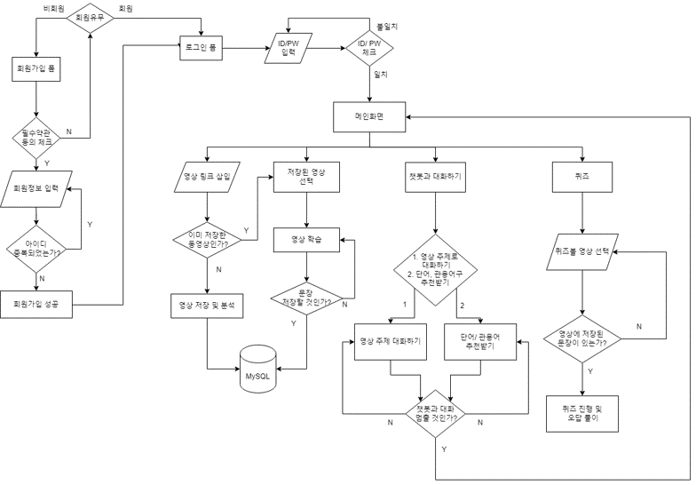

# 🎬 AI 빅데이터 기술을 활용하는 영어학습 솔루션

> 사용자가 입력한 유튜브 영상에서 영어·한국어 자막을 제공하고,  
> 영상 학습·챗봇·퀴즈 기능을 지원하는 영어 학습 웹 서비스입니다.

### 1. 제작기간

> 2024.04.28 ~ 2024.09.06

### 2. 참여 인원

> |                    Name                    |  Position   |
> | :----------------------------------------: | :---------: |
> | [오성빈](https://github.com/5castle0) |    Back     |
> |   [나예은](https://github.com/hera1228)    |    Back     |

### 3. 역할 분담

> - 오성빈 : 챗봇, 저장 관련 , 로그인, 문장 분석
> - 나예은 : 영상 관련, 퀴즈, 회원가입

---

## 📝 프로젝트 개요

- **프로젝트 유형**: 한이음 ICT 멘토링
- **담당 역할**: 백엔드 개발
- **주요 담당**
  - 유튜브 URL 및 자막 처리
  - Whisper API 기반 음성 인식
  - OpenAI API 기반 자막 번역 및 챗봇 구현
  - 영상·문장·단어·퀴즈 데이터 구조 설계
  - React 연동을 위한 Django API 개발

---

## 🛠 기술 스택

- **Backend**: Python, Django
- **Frontend**: React, JavaScript
- **Database**: MySQL
- **AI API**: Whisper API, OpenAI API
- **External API**: YouTube API
- **Collaboration**: Git, GitHub, Notion, Figma, Postman

---

## 📊 시스템 구성

<!-- 시스템 구성도 이미지를 images 폴더에 넣은 후 파일명을 수정하세요. -->




---

## 🔍 핵심 기능

### 1. 유튜브 영상 및 자막 처리

1. 사용자가 입력한 유튜브 URL을 Django 서버로 전달합니다.
2. 서버에서 영상 제목, URL, 자막 정보를 조회합니다.
3. 영어 자막이 있으면 기존 자막을 가져옵니다.
4. 영어 자막이 없으면 영상의 오디오를 추출하고 Whisper API로 변환합니다.
5. 한국어 자막이 없으면 영어 자막을 OpenAI API로 번역합니다.
6. 영어·한국어 자막과 영상 정보를 React에 반환합니다.

자막 데이터에는 문장과 함께 시작 시간 및 재생 시간을 저장해 영상 재생 위치와 연결했습니다.

```json
{
  "text": "Your rich, eccentric uncle just passed away.",
  "start": 6.72,
  "duration": 3.63
}
```


### 2. 영상 학습

- 영어·한국어 자막 선택 표시
- 영상 재생, 정지 및 재생 속도 조절
- 자막 문장 선택
- 문장과 단어 저장
- 저장한 문장 및 단어 조회


### 3. 대화 기록 기반 챗봇

사용자의 현재 메시지만 전달하지 않고, 이전 대화 내용을 함께 OpenAI API에 전달해 연속적인 대화를 구현했습니다.

```python
def chatbot(request_message, message_history, client):
    message_history.append({
        "role": "user",
        "content": request_message,
    })

    response = client.chat.completions.create(
        model="gpt-3.5-turbo",
        messages=message_history,
        temperature=0.5,
    )

    answer = response.choices[0].message.content

    message_history.append({
        "role": "assistant",
        "content": answer,
    })

    return answer
```

- 영상 주제 기반 대화
- 영어 단어 추천
- 자주 사용하는 영어 회화 추천
- 일반 영어 학습 질의응답


### 4. 저장 데이터 기반 퀴즈

사용자가 영상 학습 중 저장한 문장과 단어를 활용해 퀴즈를 제공합니다.

- 단어 퀴즈
- 문장 퀴즈
- 랜덤 퀴즈
- 오답 다시 풀기
- 영상별 저장 문장 및 단어 조회

저장한 데이터가 없을 경우 퀴즈를 생성하지 않고 안내 메시지를 반환하도록 처리했습니다.

---

## 💻 핵심 코드

### 1. 영어 자막이 없는 영상 처리

```python
from pytube import YouTube


def extract_audio_and_transcribe(url, client):
    youtube = YouTube(url)

    audio_stream = youtube.streams.filter(
        only_audio=True,
    ).first()

    audio_path = audio_stream.download(
        filename="audio.mp4",
    )

    with open(audio_path, "rb") as audio_file:
        response = client.audio.transcriptions.create(
            model="whisper-1",
            file=audio_file,
            response_format="verbose_json",
        )

    subtitles = []

    for segment in response.segments:
        subtitles.append({
            "text": segment["text"],
            "start": segment["start"],
            "duration": segment["end"] - segment["start"],
        })

    return subtitles
```

Whisper의 시간 정보를 함께 저장해 영상 재생 위치에 맞는 자막을 표시할 수 있도록 구성했습니다.


### 2. 한국어 자막 자동 번역

```python
def translate_subtitles(english_subtitles, client):
    response = client.chat.completions.create(
        model="gpt-3.5-turbo",
        messages=[
            {
                "role": "user",
                "content": (
                    "다음 영어 자막의 text 값만 한국어로 번역하세요.\n"
                    f"{english_subtitles}"
                ),
            }
        ],
    )

    return response.choices[0].message.content
```

기존 한국어 자막이 없는 경우에만 번역 API를 호출하도록 처리했습니다.

---

## 🗄 데이터베이스 설계

<!-- ERD 이미지를 images 폴더에 넣은 후 파일명을 수정하세요. -->


| 테이블 | 역할 |
|---|---|
| `users` | 회원 정보 저장 |
| `video` | 사용자가 학습한 영상 정보 저장 |
| `sentence` | 영상에서 저장한 문장 관리 |
| `word` | 영상에서 저장한 단어 관리 |
| `quiz` | 사용자별 퀴즈 결과 저장 |
| `sentence_quiz` | 문장 퀴즈 및 오답 여부 저장 |
| `word_quiz` | 단어 퀴즈 및 오답 여부 저장 |


---

## 🚀 트러블슈팅

### 1. 영어 자막이 없는 영상 처리

#### 문제

기존 방식은 유튜브에서 제공하는 자막을 가져오는 구조였기 때문에, 영어 자막이 등록되지 않은 영상에서는 학습용 스크립트를 제공할 수 없었습니다.

#### 해결

자막 조회에 실패하면 영상의 오디오 스트림을 추출하고, Whisper API를 통해 음성을 영어 텍스트로 변환하도록 대체 처리 경로를 구현했습니다.

```python
from pytube import YouTube


# 영어 자막이 없는 경우 오디오 스트림 추출
youtube = YouTube(url)

stream = youtube.streams.filter(
    only_audio=True
).first()

audio_file_path = stream.download(
    filename="audio.mp4"
)

# Whisper API에 전달할 오디오 파일 열기
audio_file = open(audio_file_path, "rb")

response = client.audio.transcriptions.create(
    model="whisper-1",
    file=audio_file,
    response_format="verbose_json"
)

script = response.text
transcription_en = []

# 문장별 텍스트와 시간 정보 구성
for content in response.segments:
    text = content["text"]
    start = content["start"]
    end = content["end"]
    duration = end - start

    transcription_en.append({
        "text": text,
        "start": start,
        "duration": duration
    })
```

Whisper의 `verbose_json` 응답에서 문장뿐 아니라 시작 시간과 종료 시간을 함께 추출했습니다. 이를 통해 생성된 스크립트를 영상 재생 시점과 연결할 수 있도록 구성했습니다.

한국어 자막이 없는 경우에는 생성된 영어 자막을 OpenAI API에 전달해 번역했습니다.

```python
response = client.chat.completions.create(
    model="gpt-3.5-turbo",
    messages=[
        {
            "role": "user",
            "content": (
                f"{transcription_en}\n"
                "Translate only the values corresponding "
                "to 'text' into Korean."
            )
        }
    ],
    temperature=0.7
)

transcription_ko = response.choices[0].message.content
```

#### 결과

```text
영어 자막 존재
→ YouTube 자막 사용

영어 자막 미존재
→ 오디오 추출
→ Whisper 음성 인식
→ 문장별 시간 정보 생성

한국어 자막 미존재
→ OpenAI API 번역
```

자막이 등록되지 않은 영상도 영어·한국어 스크립트와 함께 학습 콘텐츠로 제공할 수 있게 되었습니다.

---

### 2. 챗봇 대화 흐름 단절 문제

#### 문제

사용자의 현재 메시지만 OpenAI API에 전달하면 이전 질문과 답변이 유지되지 않아, 후속 질문에도 매번 독립적인 답변이 생성되었습니다.

예를 들어 사용자가 앞서 선택한 영상이나 추천받은 단어에 대해 추가 질문해도 챗봇이 이전 맥락을 파악하지 못했습니다.

#### 해결

사용자와 챗봇의 메시지를 `message_history`에 순서대로 누적하고, API 요청 시 전체 대화 기록을 전달하도록 변경했습니다.

```python
def chatbot(request, message_history):
    if request == "exit":
        return

    # 사용자 메시지를 대화 기록에 추가
    message_history.append({
        "role": "user",
        "content": request
    })

    response = client.chat.completions.create(
        model="gpt-3.5-turbo",
        messages=message_history,
        max_tokens=1024,
        stop=None,
        temperature=0.5
    )

    # 챗봇 응답도 대화 기록에 추가
    message_history.append({
        "role": "assistant",
        "content": response.choices[0].message.content
    })

    return message_history[-1]["content"]
```

처리 흐름은 다음과 같습니다.

```text
사용자 메시지 입력
→ message_history에 user 메시지 추가
→ 전체 대화 기록을 OpenAI API에 전달
→ 응답을 assistant 메시지로 저장
→ 다음 요청에서도 기존 대화 기록 재사용
```

---

## 🖥 실행 화면

### 영상 URL 입력


### 영상 및 자막 학습


### AI 챗봇


### 저장 문장 및 단어


### 퀴즈


