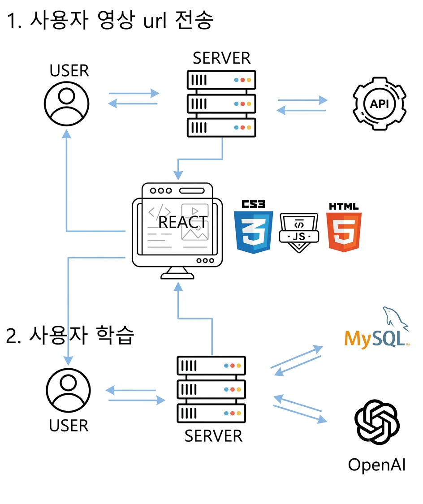
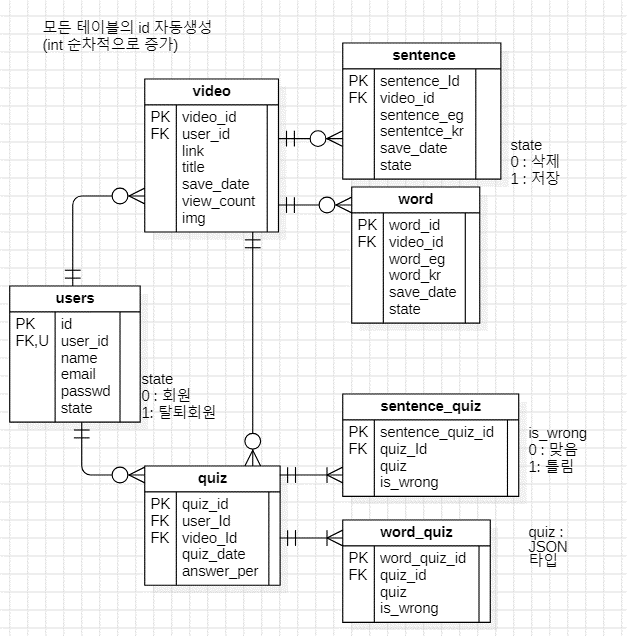
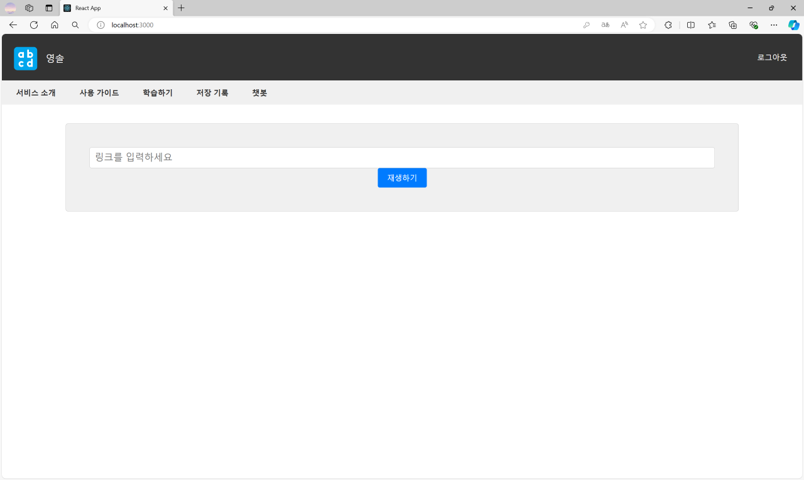
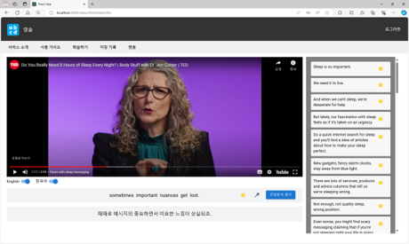
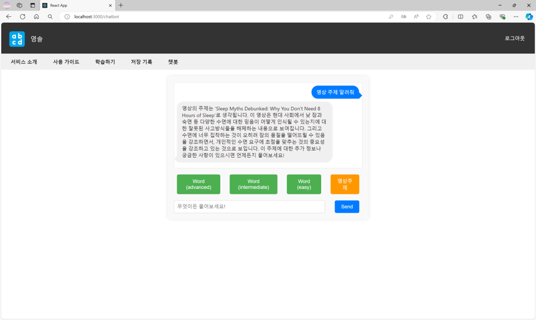
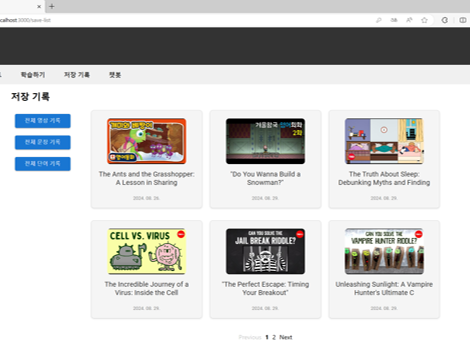
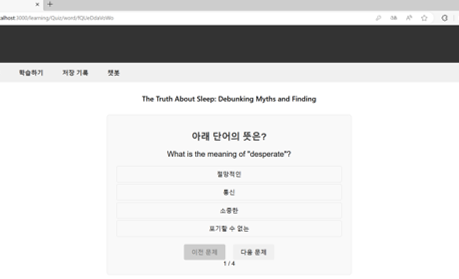

# 🎬 AI 빅데이터 기술을 활용하는 영어학습 솔루션

> 사용자가 입력한 유튜브 영상에서 영어·한국어 자막을 제공하고,  
> 영상 학습·챗봇·퀴즈 기능을 지원하는 영어 학습 웹 서비스입니다.

<br />

### 1. 제작기간

> 2024.04.28 ~ 2024.09.06

### 2. 참여 인원

> |                    Name                    |  Position   |
> | :----------------------------------------: | :---------: |
> | [오성빈](https://github.com/5castle0) |    Back     |
> |   [나예은](https://github.com/hera1228)    |    Back     |

### 3. 역할 분담

> - 오성빈 : 챗봇, 저장 관련 , 로그인, 문장 분석
> - 나예은 : 영상 관련, 퀴즈, 회원가입

---

## 📝 프로젝트 개요

- **프로젝트 유형**: 한이음 ICT 멘토링
- **담당 역할**: 백엔드 개발
- **주요 담당**
  - 유튜브 URL 및 자막 처리
  - Whisper API 기반 음성 인식
  - OpenAI API 기반 자막 번역 및 챗봇 구현
  - 영상·문장·단어·퀴즈 데이터 구조 설계
  - React 연동을 위한 Django API 개발

---

## 🛠 기술 스택

- **Backend**: Python, Django
- **Frontend**: React, JavaScript
- **Database**: MySQL
- **AI API**: Whisper API, OpenAI API
- **External API**: YouTube API
- **Collaboration**: Git, GitHub, Notion, Figma, Postman

---

## 📊 시스템 구성

<!-- 시스템 구성도 이미지를 images 폴더에 넣은 후 파일명을 수정하세요. -->



```text
사용자
  ↓ 유튜브 URL 입력
React
  ↓ 영상 처리 요청
Django Server
  ├─ 영어 자막 있음 → YouTube 자막 추출
  ├─ 영어 자막 없음 → 오디오 추출 → Whisper 음성 인식
  └─ 한국어 자막 없음 → OpenAI 번역
  ↓
영상 정보·영어 자막·한국어 자막 반환
  ↓
영상 학습·챗봇·퀴즈 제공
```

---

## 🔍 핵심 구현

### 1. 유튜브 영상 및 자막 처리

1. 사용자가 입력한 유튜브 URL을 Django 서버로 전달합니다.
2. 서버에서 영상 제목, URL, 자막 정보를 조회합니다.
3. 영어 자막이 있으면 기존 자막을 가져옵니다.
4. 영어 자막이 없으면 영상의 오디오를 추출하고 Whisper API로 변환합니다.
5. 한국어 자막이 없으면 영어 자막을 OpenAI API로 번역합니다.
6. 영어·한국어 자막과 영상 정보를 React에 반환합니다.

자막 데이터에는 문장과 함께 시작 시간 및 재생 시간을 저장해 영상 재생 위치와 연결했습니다.

```json
{
  "text": "Your rich, eccentric uncle just passed away.",
  "start": 6.72,
  "duration": 3.63
}
```

---

### 2. 영상 학습

- 영어·한국어 자막 선택 표시
- 영상 재생, 정지 및 재생 속도 조절
- 자막 문장 선택
- 문장과 단어 저장
- 저장한 문장 및 단어 조회

---

### 3. 대화 기록 기반 챗봇

사용자의 현재 메시지만 전달하지 않고, 이전 대화 내용을 함께 OpenAI API에 전달해 연속적인 대화를 구현했습니다.

```python
def chatbot(request_message, message_history, client):
    message_history.append({
        "role": "user",
        "content": request_message,
    })

    response = client.chat.completions.create(
        model="gpt-3.5-turbo",
        messages=message_history,
        temperature=0.5,
    )

    answer = response.choices[0].message.content

    message_history.append({
        "role": "assistant",
        "content": answer,
    })

    return answer
```

챗봇 기능

- 영상 주제 기반 대화
- 영어 단어 추천
- 자주 사용하는 영어 회화 추천
- 일반 영어 학습 질의응답

---

### 4. 저장 데이터 기반 퀴즈

사용자가 영상 학습 중 저장한 문장과 단어를 활용해 퀴즈를 제공합니다.

- 단어 퀴즈
- 문장 퀴즈
- 랜덤 퀴즈
- 오답 다시 풀기
- 영상별 저장 문장 및 단어 조회

저장한 데이터가 없을 경우 퀴즈를 생성하지 않고 안내 메시지를 반환하도록 처리했습니다.

---

## 💻 핵심 코드

### 영어 자막이 없는 영상 처리

```python
from pytube import YouTube


def extract_audio_and_transcribe(url, client):
    youtube = YouTube(url)

    audio_stream = youtube.streams.filter(
        only_audio=True,
    ).first()

    audio_path = audio_stream.download(
        filename="audio.mp4",
    )

    with open(audio_path, "rb") as audio_file:
        response = client.audio.transcriptions.create(
            model="whisper-1",
            file=audio_file,
            response_format="verbose_json",
        )

    subtitles = []

    for segment in response.segments:
        subtitles.append({
            "text": segment["text"],
            "start": segment["start"],
            "duration": segment["end"] - segment["start"],
        })

    return subtitles
```

Whisper의 시간 정보를 함께 저장해 영상 재생 위치에 맞는 자막을 표시할 수 있도록 구성했습니다.

---

### 한국어 자막 자동 번역

```python
def translate_subtitles(english_subtitles, client):
    response = client.chat.completions.create(
        model="gpt-3.5-turbo",
        messages=[
            {
                "role": "user",
                "content": (
                    "다음 영어 자막의 text 값만 한국어로 번역하세요.\n"
                    f"{english_subtitles}"
                ),
            }
        ],
    )

    return response.choices[0].message.content
```

기존 한국어 자막이 없는 경우에만 번역 API를 호출하도록 처리했습니다.

---

## 🗄 데이터베이스 설계

<!-- ERD 이미지를 images 폴더에 넣은 후 파일명을 수정하세요. -->



| 테이블 | 역할 |
|---|---|
| `users` | 회원 정보 저장 |
| `video` | 사용자가 학습한 영상 정보 저장 |
| `sentence` | 영상에서 저장한 문장 관리 |
| `word` | 영상에서 저장한 단어 관리 |
| `quiz` | 사용자별 퀴즈 결과 저장 |
| `sentence_quiz` | 문장 퀴즈 및 오답 여부 저장 |
| `word_quiz` | 단어 퀴즈 및 오답 여부 저장 |

문장과 단어를 별도 테이블로 분리해 각각 문장 학습, 단어장, 퀴즈 기능에 활용했습니다.

---

## 🚀 트러블슈팅

### 자막이 없는 영상 처리

**문제**

유튜브 영상에 영어 자막이 없으면 기존 자막 조회 방식으로 학습 스크립트를 제공할 수 없었습니다.

**해결**

```text
영상 오디오 추출
→ Whisper API 음성 인식
→ 문장·시작 시간·재생 시간 생성
→ 영상 자막으로 제공
```

이를 통해 영어 자막이 없는 영상도 학습 콘텐츠로 사용할 수 있도록 했습니다.

### 챗봇 대화 단절 문제

**문제**

현재 질문만 API에 전달하면 이전 대화 내용을 반영할 수 없었습니다.

**해결**

사용자와 챗봇의 메시지를 `message_history`에 누적하고, 매 요청마다 전체 대화 내용을 전달했습니다.

이를 통해 영상 주제와 앞선 질문을 반영하는 연속형 챗봇을 구현했습니다.

---

## 📈 성과

- 유튜브 URL 입력부터 영어·한국어 자막 제공까지의 백엔드 처리 흐름 구현
- Whisper API를 활용한 자막 미제공 영상 처리
- OpenAI API 기반 한국어 자막 번역 및 대화형 챗봇 구현
- 자막 시간 정보를 영상 재생 위치와 연동
- 문장·단어 저장 및 퀴즈 복습 구조 구현
- 사용자·영상·문장·단어·퀴즈 데이터 관계 설계

---

## 🖥 실행 화면

<!-- 실제 이미지 파일을 images 폴더에 올리고 아래 파일명을 수정하세요. -->

### 영상 URL 입력



### 영상 및 자막 학습



### AI 챗봇



### 저장 문장 및 단어



### 퀴즈


